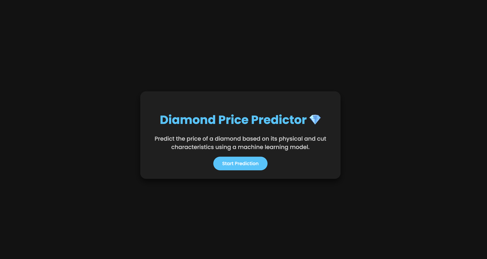
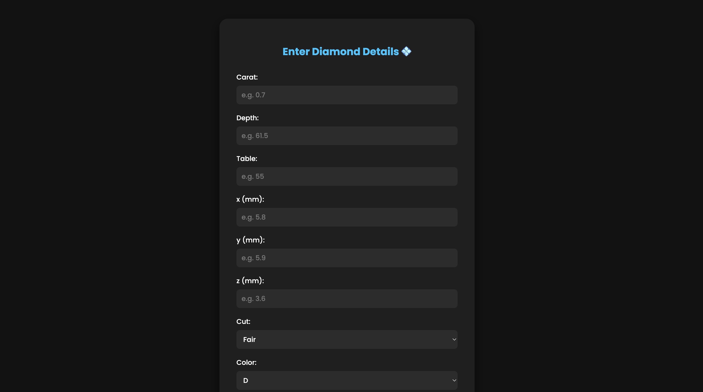
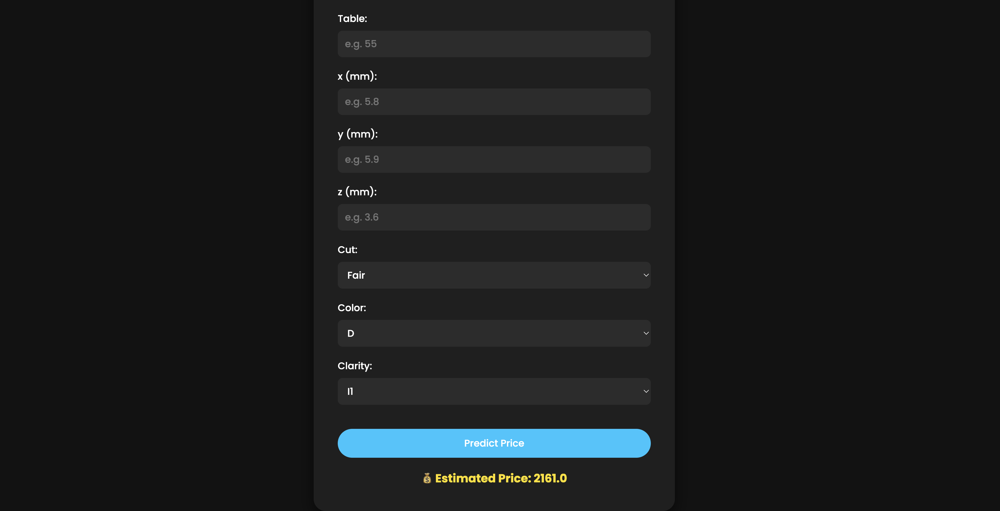

# 💎 Diamond Price Predictor

A simple yet powerful web application that predicts the price of a diamond based on various physical and cut characteristics using a trained machine learning model.

## 📸 Demo Screenshots

### 🔹 Home Page (index.html)


### 🔹 Prediction Form (form.html)


### 🔹 Result Example


---

## 🚀 Features

- Predict diamond prices using features like carat, cut, clarity, and dimensions.
- Sleek dark mode UI for better user experience.
- Built with **Flask** for backend and pure **HTML/CSS** for frontend.
- Model trained using **scikit-learn** on a real-world diamond dataset.

---

## 🧪 Tech Stack

- **Frontend:** HTML, CSS (Dark Mode)
- **Backend:** Python (Flask)
- **ML Model:** scikit-learn (RandomForestRegressor or any regressor of your choice)

---

## 📦 Setup Instructions

### 1. Clone the repository

```bash
git clone https://github.com/yourusername/diamond-price-predictor.git
cd diamond-price-predicto
```

### 2. Create a virtual environment (optional but recommended)
```bash
python -m venv venv
source venv/bin/activate  # On Windows use: venv\Scripts\activate
```

### 3. Install the dependencies
```bash
pip install -r requirements.txt
```

### 4. Run the Flask App
```bash
python app.py
```

The app will be live at http://127.0.0.1:5000/

## 📁 Project Structure
``` bash
diamond_price_prediction/
│
├── artifacts/                  # Stored artifacts: models, preprocessor, datasets
│   ├── model.pkl
│   ├── preprocessor.pkl
│   ├── raw.csv
│   ├── train.csv
│   └── test.csv
│
├── notebooks/                  # EDA and experimentation
│   └── EDA.ipynb
│
├── src/                        # Core source code
│   ├── components/             # Data ingestion, transformation, model training
│   │   ├── data_ingestion.py
│   │   ├── data_transformation.py
│   │   └── model_trainer.py
│   │
│   ├── pipelines/              # Training and prediction pipeline runners
│   │   ├── training_pipeline.py
│   │   └── prediction_pipeline.py
│   │
│   ├── utils.py                # Utility/helper functions
│   ├── logger.py               # Custom logging
│   ├── exception.py            # Custom exceptions
│   └── __init__.py
│
├── templates/                  # Frontend templates for Flask
│   ├── index.html              # Landing page (dark mode)
│   └── form.html               # Prediction input form (dark mode)
│
├── application.py              # Flask app entry point
├── setup.py                    # Setup for pip install (if packaging)
├── requirements.txt            # Project dependencies
├── README.md                   # Project documentation
└── .gitignore                  # Files to ignore in Git
```

## 📈 Input Features

	•	carat: Weight of the diamond
	•	depth: Total depth percentage
	•	table: Width of the top of the diamond relative to widest point
	•	x, y, z: Length, width, and depth in mm
	•	cut: Quality of the cut (Ideal, Premium, etc.)
	•	color: Diamond color grading (D–J)
	•	clarity: Measure of inclusions (I1–IF)


